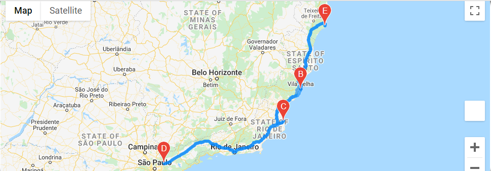

# World_Weather_Analysis

## Project Overview

The following additions to the PlanMyTrip App were developed for beta testing to improve on the available features

a) An interactive ***Customer Travel Destinations Map*** that displays a list of potential travel destinations based on user input for weather criteria.  

b) ***Create a Travel Itinerary Map** based on four cities of the users choice. With the use of Google Maps Directions API, the user will be able to view the travel route between the four cities as well as detailed destination markers 

Both maps will be equipped with destinations markers that provide the user the follwing information:

- Hotel name
- City
- Country
- Current weather description with the maximum temperature

## Resources 

- Software: Anaconda 4.9.2, Jupyter Notebook 6.1.4, Python 3.8.5
- Data Sources: 
   1. Data Analysis: [Vacation_Search](Vacation_Search.ipynb), [Vacation_Itinerar](Vacation_Vacation_Itinerary.ipynb)
   2. Raw data: [WeatherPy_Database.csv](Weather_Database/WeatherPy_Database.csv)

## Results

1. Customer Travel Destinations Map:

After inputing the desired weather preferences, a customized travel destinations map will be generated with potential vacation destinations and nearby hotels withing the users criteria. See example below.

  

2. Vacation Itinerary

Based on the filtered weather criteria the user will be able to choose a starting/end point, and three additional destination stops to be added to a new travel map. 

  

  

