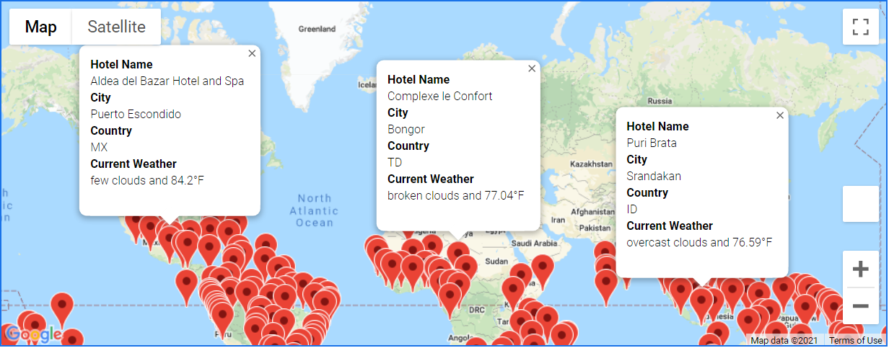
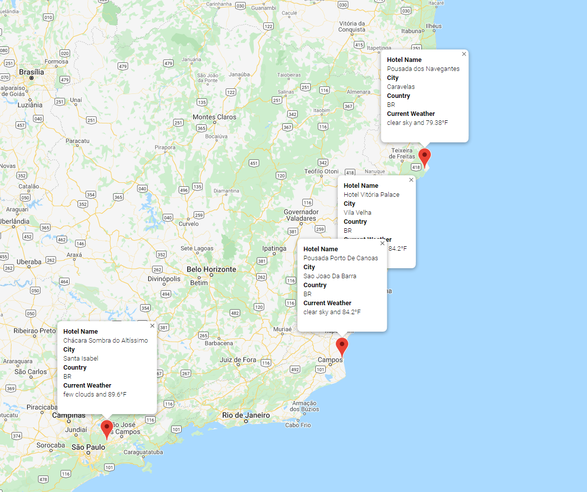

# World_Weather_Analysis

## Project Overview

The following additions were developed for beta testing in the PlanMyTrip App to improve on the available features.

a) A ***Customer Travel Destinations Map*** that displays a list of potential vacation lacations based on the user's input for desired weather.  

b) A ***Travel Itinerary Map*** based on four cities of the user's choice. With the use of Google Maps Directions API, the user will be able to view the travel route between the four cities as well the detailed location info markers. 

Both maps are equipped with detailed destination markers that provide the user with the following information:

- Hotel name
- City
- Country
- Current weather description with the maximum temperature (F°)

## Resources 

- Software: Anaconda 4.9.2, Jupyter Notebook 6.1.4, Python 3.8.5
- Data Sources: 
   1. Data Analysis: [Vacation_Search](Vacation_Search/Vacation_Search.ipynb), [Vacation_Itinerary](Vacation_Itinerary/Vacation_Itinerary.ipynb)
   2. Raw data: [WeatherPy_Database.csv](Weather_Database/WeatherPy_Database.csv)

## Preview

#### 1. Customer Travel Destinations Map:

- After inputting the desired weather preferences, a customized travel destinations map will be generated with potential vacation destinations and nearby hotels withing the user's criteria. See example below.

  <kbd><kbd>

#### 2. Vacation Itinerary

- Based on the filtered weather criteria the user will be able to choose a starting/end point, and three additional destination stops to be added to a new travel map. 

  <kbd><kbd>

  <kbd><kbd>

